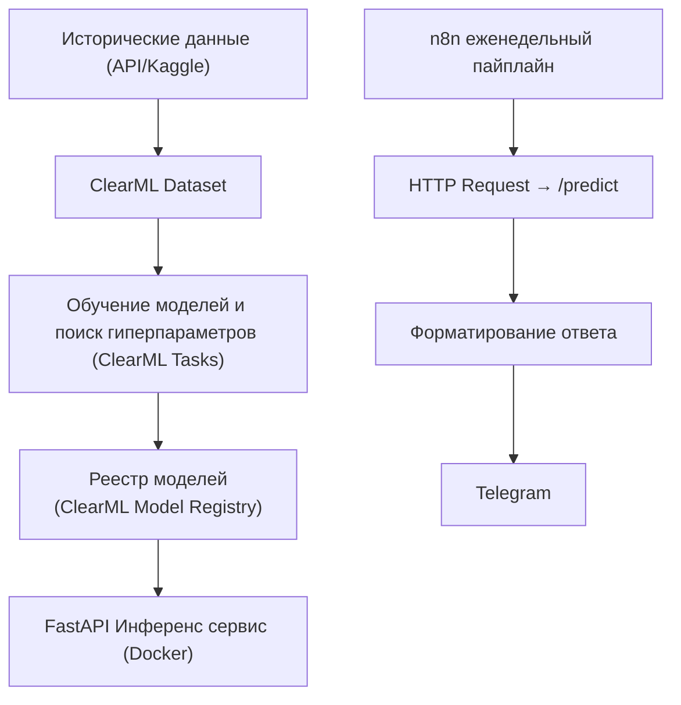

# Задание к лабораторной работе №3

## Цели

1. Освоить полный цикл оркестрации ML‑проекта в **ClearML**: датасет → эксперименты → подбор гиперпараметров → реестр моделей → деплой.
2. На практике реализовать инференс‑сервис (`FastAPI`) для прогноза на 7 дней вперёд.
3. Настроить n8n‑пайплайн с еженедельным расписанием, который запрашивает прогноз у сервиса и отправляет его в Telegram.

---

## Постановка задачи (пайплайн)

1. **ClearML**
   * Поднять **ClearML Server** (`docker-compose`) и настроить **Agent** (*опционально*).
   * Создать **ClearML Dataset** c историческими данными.
   * Реализовать скрипты для полного цикла обучения, поиска гиперпараметров (HPO), оценки модели с использованием логирования в **ClearML**: метрики (MAE/RMSE/MAPE/AUC), артефакты (конфиг, важности признаков, графики).
   * Выполнить **HPO** (не менее 10 конфигураций) и зарегистировать лучшую модель в **Model Registry** (указать версию/теги).
2. **Признаки и модели**
   * Разрешается использовать любые признаки: календарные признаки (dow, doy, sin/cos сезонности), лаги и скользящие агрегаты.
   * Разрешается использовать любые модели: LightGBM/XGBoost/CatBoost, Prophet, LSTM/Temporal‑Conv, и т.д.
   * Горизонт Предсказаний **7 дней**.
3. **Инференс‑сервис**
   * **FastAPI** с эндпоинтом `POST /predict` (вход: город, список дат \[D+1..D+7]; опц. вспомогательные признаки; выход: JSON с 7 прогнозами и доверительными интервалами/вероятностями).
   * Упаковать в **Docker**.
4. **n8n (еженедельный пайплайн)**
   * `Cron` (раз в неделю, например, ПН 07:00) → `HTTP Request` к `/predict` для выбранного города/городов → форматирование → `Telegram`.
   * Сообщение, *опционально*, можно отформатировать используя LLM из ЛР2.

---

## Исходные данные

* Студент **самостоятельно выбирает и загружает** набор исторических погодных данных:

  * **API без ключа** (например из API используемого в ЛР1) **или**
  * **публичный датасет** (например, c Kaggle).
* Целевая переменная на выбор (одна): `temp_max`, `temp_min`, `temp_avg`, `precipitation_sum` (суточные) **или** `rain_probability` (бинарная/вероятностная).
* География: минимум **1 город**, период истории ≥ **3 года**.

> В отчёте обязательно указать источник данных, ссылку/описание и диапазон дат.

---

## Ожидаемый результ

* В репозитории: экспорт workflow из n8n, `docker-compose.yml`, `.env.example`, вспомогательные скрипты, `README.md`, `report.pdf`.
* Отчет в формате `.pdf`.

### Требования к отчету

Короткий, но содержательный (до 10`000 символов). 

Требования к оформлению PDF:
Имя файла: report.pdf, шрифт читаемый, 10–12 pt, изображения не «мыльные».

### Pull Request в репозиторий c заданием

Для **сдачи** лабораторной работы:
1. Сделайте fork репозитория с заданием.
2. Залейте код и артефакты (см. список выше). Убедитесь, что репозиторий содержит всё необходимое для сдачи.
3. Откройте PR в исходный репозиторий с заголовком: Lab2: — Фамилия Имя Группа.
4. **Пожалуйста**, используйте `git` для работы с *github*.

### Снижение оценки

Оценка может быть снижена при нарушении следующих правил. Нижеприведённые санкции и примеры — ориентиры; преподаватель оставляет за собой право учитывать контекст.

#### 1) Ручная загрузка файлов в репозиторий
**Что считается нарушением:** загрузка через веб-интерфейс (“Upload files”).

**Как избежать:** используйте `git add/commit/push`, исключайте ненужные файлы и артефакты в `.gitignore`.

#### 2) Спам коммитами
**Что считается нарушением:** серия мелких коммитов без содержательных сообщений и/или осмысленных изменений (например, десятки коммитов подряд вида “fix”, “upd”, правки пробелов).  

**Примеры:**  
- \>10 коммитов за короткий промежуток времени с правками форматирования.  
- Коммиты без описания причины изменений.

**Как избежать:** объединяйте правки (`git add -p`, `git commit --amend`, `git rebase -i`), пишите информативные сообщения коммитов.

#### 3) Плагиат кода или отчёта
**Что считается нарушением:** при подозрении заимствования фрагментов кода/текста без явного указания источника или выдача чужой работы за свою (включая ИИ-генерированный текст без раскрытия факта использования).  

**Штраф:** до 0 баллов за работу; возможна неудовлетворительная оценка по дисциплине. 

**Порядок действий:** при обнаружении плагиата студент вызывается на очную защиту лабораторной работы; по итогам защиты решение по оценке может быть пересмотрено.  
