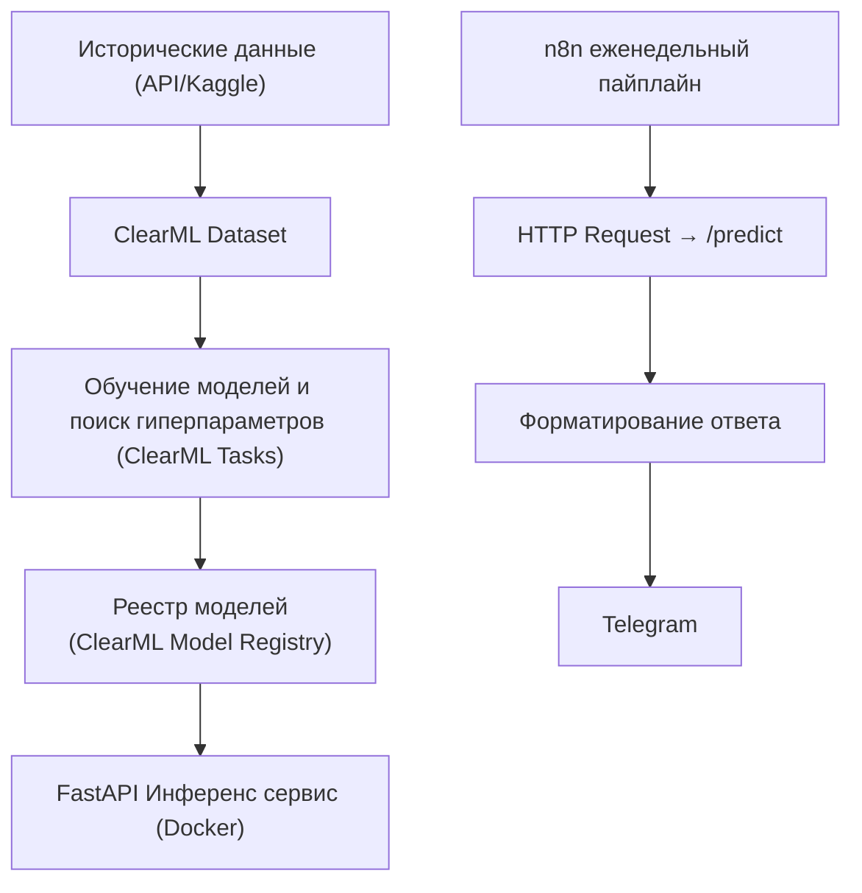

# Задание к лабораторной работе №3

---

## Постановка задачи (пайплайн)

1. **ClearML**
   * Поднять **ClearML Server** (`docker-compose`) и настроить **Agent** (*опционально*).
   * Создать **ClearML Dataset** c историческими данными.
   * Реализовать скрипты для полного цикла обучения, поиска гиперпараметров (HPO), оценки модели с использованием логирования в **ClearML**: метрики (MAE/RMSE/MAPE/AUC), артефакты (конфиг, важности признаков, графики).
   * Выполнить **HPO** (не менее 10 конфигураций) и зарегистировать лучшую модель в **Model Registry** (указать версию/теги).
2. **Признаки и модели**
   * Разрешается использовать любые признаки: календарные признаки (dow, doy, sin/cos сезонности), лаги и скользящие агрегаты.
   * Разрешается использовать любые модели: LightGBM/XGBoost/CatBoost, Prophet, LSTM/Temporal‑Conv, и т.д.
   * Горизонт Предсказаний **7 дней**.
3. **Инференс‑сервис**
   * **FastAPI** с эндпоинтом `POST /predict` (вход: город, список дат \[D+1..D+7]; опц. вспомогательные признаки; выход: JSON с 7 прогнозами и доверительными интервалами/вероятностями).
   * Упаковать в **Docker**.
4. **n8n (еженедельный пайплайн)**
   * `Cron` (раз в неделю, например, ПН 07:00) → `HTTP Request` к `/predict` для выбранного города/городов → форматирование → `Telegram`.
   * Сообщение, *опционально*, можно отформатировать используя LLM из ЛР2.

